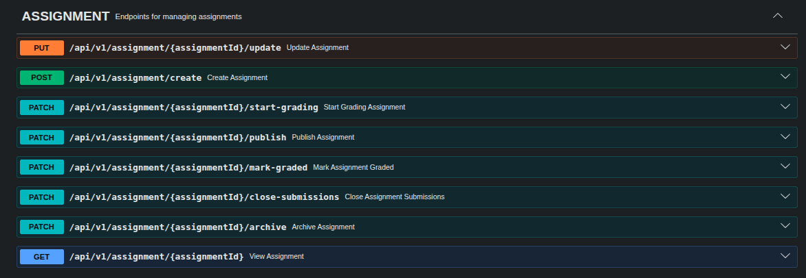
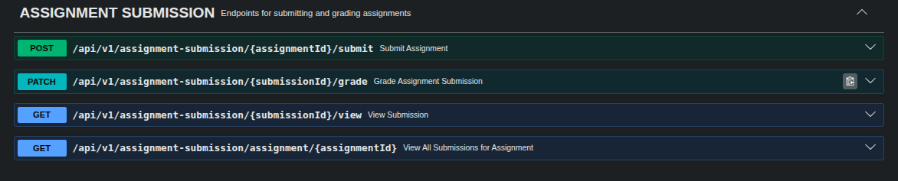

# Unicore
UniCore is a backend API implemented in Java Spring Boot for managing university operations. It provides RESTful endpoints for courses, assignments, assignment submissions, and course materials, enforcing academic workflows, student enrollments, and role-based access control (RBAC) for students, lecturers, and admins. Authentication and authorization are fully secured with JWTs, and test cases cover all authentication flows to ensure proper access control and system integrity.The project is containerized using Docker with multi-stage builds, and a CI/CD pipeline ensures automated testing and safe deployment to staging and production environments.
****

# Authentication & Authorization Module

Features

JWT Authentication – Secure login and token-based authentication.

Role-Based Access Control (RBAC) – Assign roles to users and define permissions.

Profile Management – Endpoints for creating, updating, and viewing user profiles.

Testing – Fully tested with unit and integration tests for critical endpoints.

****

***
## Authorization & Course Module Update

- Added course management endpoints
- Added role assignment to users
- Added permission assignment to roles
- Enforced RBAC using `@PreAuthorize`

### Highlights

- Secure course lifecycle management
- Centralized exception handling
- Duplicate role/permission validation
- Admin-only assignment control

Screenshots demonstrating the endpoints are included below.

### ROLE AND PERMISSION ASSIGNMENT

### COURSE MANAGEMENT

# Assignment & Submission API

## Overview

This module implements the **Assignment** and **Assignment Submission** workflows for the learning system.

### Workflow

1. Lecturer creates an assignment
2. Lecturer publishes the assignment
3. Students view and submit assignments
4. Lecturer reviews and grades submissions

All endpoints are secured using **JWT authentication** and **permission-based authorization**.

---

# Assignment Endpoints

# Assignment Submission Endpoints

Supported operations:

- Submit assignment (PDF upload)
- View submission
- View all submissions for an assignment
- View student submission
- Grade submission

# Course Enrollment

 This module allows students to enroll in courses and provides endpoints to retrieve enrollment information.

## Features

- Enroll a student in a course

- Get the number of students enrolled in a course

- Retrieve the list of students enrolled in a course

# Course Materials

 This module allows students to view and download  course materials  and provides endpoints for lecturers to manage course materials.

## Features

- Lecturers can upload course materials (PDF, DOCX, or video links)

- Students can view and download materials for courses they are enrolled in

- Soft delete support for course materials

- Secure access: only lecturers or enrolled students can access the materials

# Security Features

- This application includes:
- IP-based Rate Limiting (Bucket4j)
- Email-based Brute Force Protection for login

## Rate Limiting

Implemented using a Spring Security filter.

| Endpoint                | Limit                    |
| ----------------------- |--------------------------|
| `/api/v1/auth/login`    | 15 requests / 10 minutes |
| `/api/v1/auth/register` | 7 requests / hour        |
| Others                  | 20 requests / minute     |

### Response on limit exceeded:

- 429 Too Many Requests
- Includes Retry-After response header indicating when to retry

### Brute Force Protection
- Tracks failed login attempts per email
- Blocks login after 5 failed attempts
- Block duration: 15 minutes
- Resets on successful login

#### Design
- Filter → handles IP-based rate limiting
- Service layer → handles email-based login protection

# Available AT
https://rbac-server-latest.onrender.com

# Public Health Endpoint
https://rbac-server-latest.onrender.com/api/v1/auth/health

# The health of the application is internally available  at:
http://localhost:8080/actuator/health

# View the API documentation at:
https://nanor-bright-suka.github.io/Unicore/
